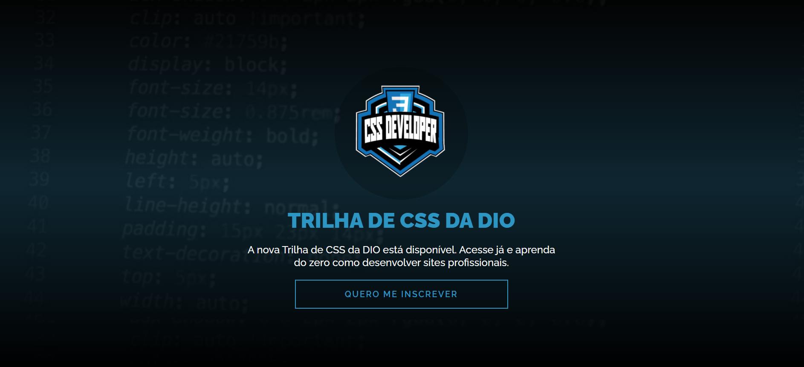

# Projeto de Landing Page Dio

## VISÃO GERAL

- Desafio 01: Criando sua primeira Landing Page com HTML e CSS.

## DESAFIOS

- Construir Landing Page com HTML e CSS, colocando na prática os fundamentos do CSS, as propriedades básicas da linguagem de estilização, além de trabalhar com as unidades de medidas relativas e absolutas que aprender ao longo da trilha.

## Cores

- cor-de-fundo: #030303;
- cor-de-texto: #f5f5f5;
- cor-de-testaque: #2d95c1;
- fundo-logo: #00000033;
- fundo-modulo: #252525;

## Tipografia

- "Raleway", sans-serif

## Links

- [URL-do-site-ativo no github]()

## Construído com

- Marcação HTML5 semântica
- Propriedades personalizadas CSS
- Flexbox
- Fluxo de trabalho que prioriza os dispositivos móveis

## Autor

- [Instagram](https://www.instagram.com/denner_souza.s/)